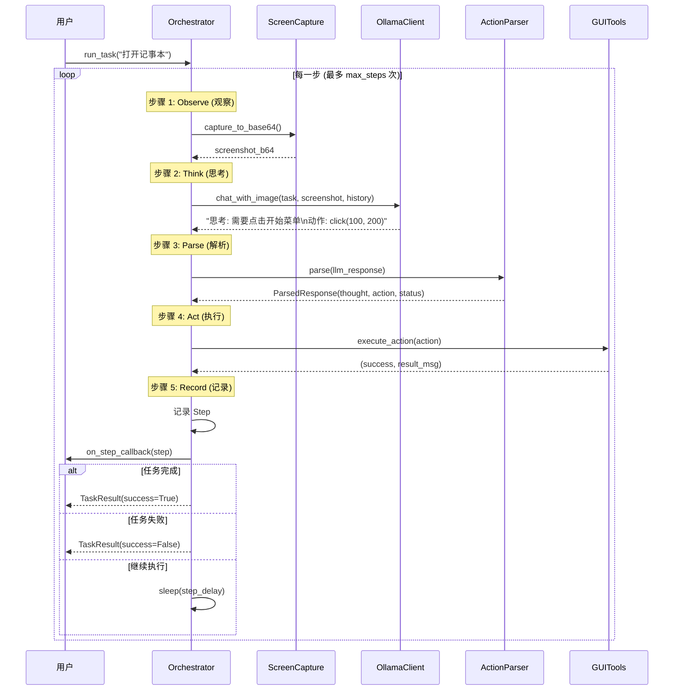

# 🤖 Qwen GUI-Agent

**一个基于 Qwen3-VL 视觉语言模型的 Windows 桌面自动化代理**

通过自然语言指令操控你的电脑！只需告诉 Agent 你想做什么，它就能自动观察屏幕、理解内容并执行操作。

---

## ✨ 特性

- 🖼️ **视觉理解**: 基于 Qwen3-VL 多模态模型，能够"看懂"你的屏幕内容
- 🎯 **ReAct 循环**: 采用 观察 → 思考 → 行动 的智能决策流程
- 🖱️ **完整 GUI 操作**: 支持鼠标点击、键盘输入、快捷键组合、滚动等
- 💬 **友好交互**: 提供 Streamlit 聊天界面，实时查看 Agent 的执行步骤与截图
- 🔧 **本地部署**: 基于 Ollama 运行，数据隐私有保障

---

## 🏗️ 项目结构

```
qwen-gui-agent/
├── main.py               # 程序入口，启动 Streamlit 应用
├── config.py             # 全局配置 (Ollama/Agent/安全设置)
├── requirements.txt      # Python 依赖
│
├── agent/                # 核心代理逻辑
│   ├── orchestrator.py   # 任务编排器，执行 ReAct 循环
│   └── action_parser.py  # LLM 响应解析器
│
├── llm/                  # 大模型交互层
│   └── ollama_client.py  # Ollama API 客户端 (多模态对话)
│
├── tools/                # GUI 工具库
│   ├── gui_tools.py      # PyAutoGUI 封装 (鼠标/键盘操作)
│   └── screen_capture.py # 屏幕截图工具
│
└── ui/                   # 用户界面
    └── streamlit_app.py  # Streamlit 聊天界面
```

---

## 🔄 核心执行流程

### ReAct 循环架构

Orchestrator 采用经典的 **ReAct (Reasoning + Acting)** 模式，通过持续的观察-思考-行动循环来完成任务：



### 执行步骤详解

#### 1️⃣ **Observe (观察)**

```python
screenshot_b64 = self.screen.capture_to_base64()
```

- 截取当前屏幕状态
- 转换为 Base64 编码，便于传输给 LLM

#### 2️⃣ **Think (思考)**

```python
llm_response = self.llm.chat_with_image(
    user_message=user_message,
    image_base64=screenshot_b64,
    history=conversation_history
)
```

- 构建提示词（第一步介绍任务，后续步骤强调连续性）
- 将截图和任务描述发送给 Qwen3-VL
- 维护对话历史，让 LLM 具有上下文记忆

#### 3️⃣ **Parse (解析)**

```python
parsed = self.parser.parse(llm_response)
# 提取: thought (思考), action.type (动作类型), action.params (参数), status (状态)
```

- 解析 LLM 的自然语言响应
- 提取结构化信息：思考过程、动作类型（click/type/hotkey/done 等）、参数、执行状态

#### 4️⃣ **Act (执行)**

```python
success, result_msg = self.tools.execute_action({
    "type": parsed.action.type.value,
    "params": parsed.action.params
})
```

- 调用 PyAutoGUI 执行实际的 GUI 操作
- 支持的动作：鼠标点击、键盘输入、快捷键、滚动、等待等

#### 5️⃣ **Record & Callback (记录与回调)**

```python
step = Step(
    step_number=step_num,
    screenshot_b64=screenshot_b64,
    thought=parsed.thought,
    action_type=parsed.action.type.value,
    action_params=parsed.action.params,
    action_result=result_msg,
    status=parsed.status
)
self.steps.append(step)
if self.on_step_callback:
    self.on_step_callback(step)  # 通知 UI 更新
```

- 记录每一步的完整信息（截图、思考、动作、结果）
- 通过回调机制实时通知 Streamlit UI 更新

### 退出条件

循环会在以下情况退出：

| 条件          | 说明                                         |
|---------------|----------------------------------------------|
| ✅ **任务完成** | LLM 返回 `done` 动作或 `completed` 状态        |
| ❌ **执行失败** | LLM 返回 `failed` 状态                         |
| ⏱️ **达到上限** | 执行步数达到 `MAX_STEPS` (默认 20)             |
| 🛑 **手动停止** | 用户调用 `orchestrator.stop()`                |

---

## 🚀 快速开始

### 1. 前置条件

- **Python**: >= 3.8
- **Ollama**: 本地安装并运行 ([安装指南](https://ollama.com/download))
- **Qwen3-VL 模型**: 需通过 Ollama 下载

```bash
# 拉取 Qwen3-VL 模型
ollama pull qwen3-vl:8b
```

### 2. 安装依赖

```bash
pip install -r requirements.txt
```

### 3. 启动应用

```bash
python main.py
```

应用将在浏览器中打开 `http://localhost:8501`，即可开始与 Agent 对话！

---

## 📝 使用示例

在聊天框中输入自然语言任务，例如：

| 任务                       | Agent 操作                           |
| -------------------------- | ------------------------------------ |
| `帮我打开记事本`           | `Win+R` → 输入 `notepad` → 回车      |
| `打开浏览器搜索天气`       | 启动浏览器 → 打开搜索引擎 → 输入查询 |
| `把这个文件夹里的图片删除` | 定位文件 → 选中 → 按 Delete 键       |

---

## ⚙️ 配置说明

编辑 `config.py` 可自定义行为：

```python
# Ollama 设置
OLLAMA_BASE_URL = "http://localhost:11434"  # Ollama 服务地址
OLLAMA_MODEL = "qwen3-vl:8b"                # 使用的模型

# Agent 设置
MAX_STEPS = 20       # 单次任务最大执行步数
STEP_DELAY = 1.0     # 每步操作间隔 (秒)

# 安全设置
PYAUTOGUI_FAILSAFE = True  # 鼠标移至屏幕角落可中止程序
```

---

## 🔐 安全提示

> [!CAUTION]
> 本工具可以直接操控你的电脑！请在可控环境下使用。

- **紧急停止**: 将鼠标快速移动到屏幕**左上角**即可强制中止
- **监督运行**: 建议首次使用时全程关注 Agent 行为
- **权限隔离**: 避免在敏感工作环境中运行

---

## 🔧 技术栈

| 组件       | 名称                                                                              |
| ---------- | --------------------------------------------------------------------------------- |
| 多模态LLM  | [Qwen3-VL](https://ollama.com/library/qwen3-vl) via [Ollama](https://ollama.com/) |
| GUI 自动化 | [PyAutoGUI](https://pyautogui.readthedocs.io/)                                    |
| 图像处理   | [Pillow](https://python-pillow.org/)                                              |
| Web 界面   | [Streamlit](https://streamlit.io/)                                                |

---

## 🤝 贡献

欢迎提交 Issue 和 Pull Request！

---

## 📄 License

MIT License
